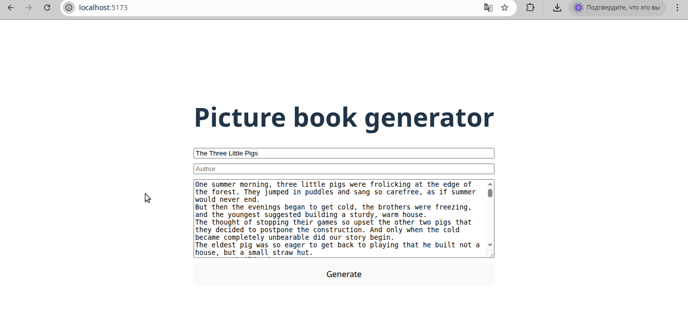

# Illustrated Book Generator

This project is a web application for generating illustrated books using large language models (LLMs).

## Description

The project consists of two main parts:

*   **Backend**: Written in Python using Django and Django REST Framework. It provides an API for processing the book's text, interacting with Google Gemini to generate the book's structure and illustrations, and then assembling a PDF file.
*   **Frontend**: Written in React. It provides a user interface for entering book data and downloading the generated PDF file.

## Project Structure

```
.
├── backend/         # Django project
│   ├── books/       # Application for working with books
│   ├── core/        # Main project settings
│   ├── test_images/ # Test images for PDF generation
│   └── ...
├── frontend/        # React project
│   └── src/
└── README.md
```

## Installation and Launch

### Requirements

*   Python 3.x
*   Node.js and npm

### Backend

1.  **Navigate to the backend directory:**
    ```bash
    cd backend
    ```

2.  **Create and activate a virtual environment:**
    ```bash
    python -m venv venv
    source venv/bin/activate  # For Linux/macOS
    # venv\Scripts\activate    # For Windows
    ```

3.  **Install dependencies:**
    ```bash
    pip install -r requirements/base.txt
    ```

4.  **Create a `.env` file** in the `backend` directory based on `env.example` and specify your `GEMINI_API_KEY`:
    ```
    GEMINI_API_KEY=your_api_key_here
    ```

5.  **Apply migrations:**
    ```bash
    python manage.py migrate
    ```

6. **Create a superuser for Django:**
    ```bash
    python manage.py createsuperuser
    ```

    ***When prompted, enter a username, any email, and your password, for example:***
    ```bash
    Username (leave blank to use 'oleg'): admin
    Email address: admin@example.com
    Password:
    Password (again):
    Superuser created successfully.
    ```

7.  **Run the development server:**
    ```bash
    python manage.py runserver
    ```

### Frontend

1.  **Navigate to the frontend directory:**
    ```bash
    cd frontend
    ```

2.  **Install dependencies:**
    ```bash
    npm install
    ```

3.  **Run the development server:**
    ```bash
    npm run dev
    ```

After starting both servers, open [http://localhost:5173/](http://localhost:5173/) in your browser.

The Django admin panel is available at [http://localhost:8000/admin](http://localhost:8000/admin)

## How It Works

1.  The user enters the title, author, and text of the book (test text can be taken from the `test_text.txt` file) in the form on the frontend.
2.  The frontend sends a POST request to the backend API.
3.  The backend:
    *   Saves the initial book data to the database.
    *   Sends the book text to Google Gemini to get structured content (text blocks and prompts for images).
    *   Saves the received structure to the database.
    *   For each prompt, it generates (or in this case, uses test images from the `test_images` folder) and saves the images.
    *   Assembles a PDF file from the text blocks and generated images.
    *   Saves the generated PDF file to the database.
    *   Returns the PDF file as a response to the request.
4.  The frontend receives the PDF file and prompts the user to download it.

